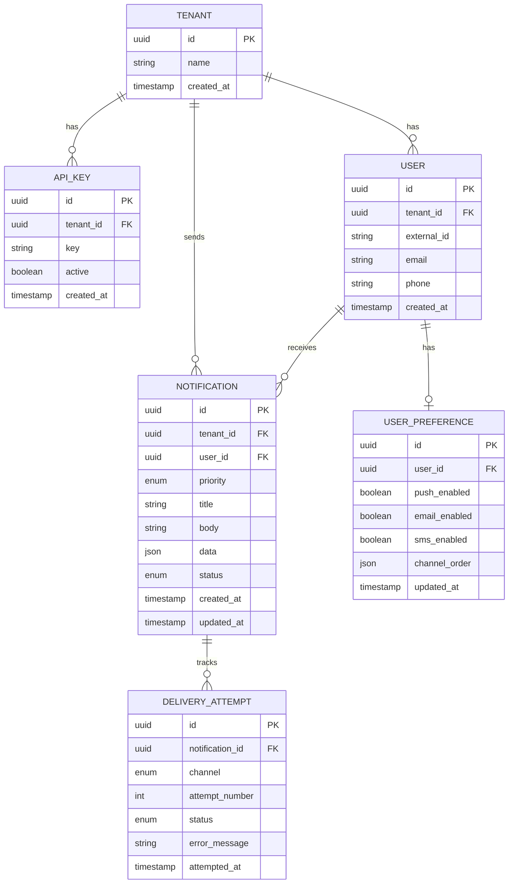

# NX — Scalable Multi-Tenant Notification Engine

Build a complete multi-tenant notification engine with priority-based queuing, multi-channel delivery (Push/Email/SMS), intelligent retry/fallback logic, and a real-time dashboard.

## Tech Stack

| Layer | Technology |
|-------|-----------|
| Frontend/Dashboard | Next.js (App Router) |
| Backend API | NestJS |
| Queue | RabbitMQ (priority queues) |
| Database | PostgreSQL + TypeORM |
| Email | AWS SES (via `@aws-sdk/client-ses`) |
| SMS | Twilio (`twilio` SDK) |
| Push | WebSockets (Socket.IO via `@nestjs/websockets`) |

---

## Project Structure

```
NX/
├── apps/
│   ├── api/                          # NestJS backend (REST API + WebSocket + Workers)
│   │   ├── src/
│   │   │   ├── main.ts
│   │   │   ├── app.module.ts
│   │   │   ├── config/
│   │   │   │   └── configuration.ts          # Centralized config
│   │   │   ├── database/
│   │   │   │   ├── database.module.ts
│   │   │   │   ├── entities/
│   │   │   │   │   ├── tenant.entity.ts
│   │   │   │   │   ├── api-key.entity.ts
│   │   │   │   │   ├── user.entity.ts
│   │   │   │   │   ├── user-preference.entity.ts
│   │   │   │   │   ├── notification.entity.ts
│   │   │   │   │   └── delivery-attempt.entity.ts
│   │   │   │   └── migrations/
│   │   │   ├── auth/
│   │   │   │   ├── auth.module.ts
│   │   │   │   ├── api-key.guard.ts          # Tenant authentication via API key
│   │   │   │   └── api-key.strategy.ts
│   │   │   ├── tenants/
│   │   │   │   ├── tenants.module.ts
│   │   │   │   ├── tenants.controller.ts
│   │   │   │   └── tenants.service.ts
│   │   │   ├── users/
│   │   │   │   ├── users.module.ts
│   │   │   │   ├── users.controller.ts
│   │   │   │   └── users.service.ts
│   │   │   ├── notifications/
│   │   │   │   ├── notifications.module.ts
│   │   │   │   ├── notifications.controller.ts  # POST /notifications
│   │   │   │   ├── notifications.service.ts     # Persist + enqueue
│   │   │   │   └── dto/
│   │   │   │       ├── create-notification.dto.ts
│   │   │   │       └── notification-response.dto.ts
│   │   │   ├── queue/
│   │   │   │   ├── queue.module.ts
│   │   │   │   ├── queue.producer.ts            # Publish to RabbitMQ
│   │   │   │   └── queue.consumer.ts            # Consume from RabbitMQ
│   │   │   ├── engine/
│   │   │   │   ├── engine.module.ts
│   │   │   │   ├── engine.service.ts            # Core routing/retry/fallback orchestrator
│   │   │   │   ├── strategies/
│   │   │   │   │   ├── important.strategy.ts    # All-channel parallel delivery
│   │   │   │   │   ├── high.strategy.ts         # Full fallback chain
│   │   │   │   │   ├── medium.strategy.ts       # Push + Email only
│   │   │   │   │   └── low.strategy.ts          # Single channel, no fallback
│   │   │   │   └── retry.service.ts             # Retry logic (max 3 retries per channel)
│   │   │   ├── channels/
│   │   │   │   ├── channels.module.ts
│   │   │   │   ├── channel.interface.ts         # Common channel interface
│   │   │   │   ├── push/
│   │   │   │   │   ├── push.service.ts          # WebSocket push delivery
│   │   │   │   │   └── push-pending.service.ts  # Offline queue management
│   │   │   │   ├── email/
│   │   │   │   │   └── email.service.ts         # AWS SES delivery
│   │   │   │   └── sms/
│   │   │   │       └── sms.service.ts           # Twilio delivery
│   │   │   ├── websocket/
│   │   │   │   ├── websocket.module.ts
│   │   │   │   ├── websocket.gateway.ts         # Socket.IO gateway
│   │   │   │   └── connection-manager.service.ts # Track online/offline users
│   │   │   └── dashboard/
│   │   │       ├── dashboard.module.ts
│   │   │       └── dashboard.controller.ts      # Stats API for frontend
│   │   ├── nest-cli.json
│   │   ├── tsconfig.json
│   │   └── package.json
│   │
│   └── web/                          # Next.js dashboard
│       ├── src/
│       │   └── app/
│       │       ├── layout.tsx
│       │       ├── page.tsx                     # Dashboard home
│       │       ├── globals.css
│       │       └── components/
│       │           ├── StatsCards.tsx
│       │           ├── PriorityChart.tsx
│       │           ├── ChannelChart.tsx
│       │           ├── RetryActivity.tsx
│       │           ├── RecentNotifications.tsx
│       │           └── DeliveryStatusTable.tsx
│       ├── next.config.js
│       ├── tsconfig.json
│       └── package.json
│
├── docker-compose.yml               # RabbitMQ + PostgreSQL
├── package.json                     # Root workspace
├── pnpm-workspace.yaml
└── README.md
```

---

## User Review Required

> [!IMPORTANT]
> **Email & SMS Providers:** AWS SES and Twilio require real credentials. The implementation will include proper service classes with the SDK integrations, but will also have a **simulation/mock mode** enabled by default so the engine works end-to-end without real credentials. Set `MOCK_CHANNELS=true` (default) to simulate delivery, or configure real credentials to use actual providers.

> [!IMPORTANT]
> **Multi-Tenancy Strategy:** Using **shared schema with `tenant_id`** on every table. This is the simplest approach for a new system and scales well. API key-based authentication will identify tenants on every request.

> [!IMPORTANT]
> **Monorepo Tooling:** Using **pnpm workspaces** for the monorepo. No Nx/Turborepo — keeping it simple since we have only 2 apps. Each app is independently runnable.

---

## Open Questions

> [!NOTE]
> **Dashboard Auth:** The dashboard currently has no login/auth — it shows aggregate data across all tenants. Should it be scoped per-tenant, or is a global admin view acceptable for now?

> [!NOTE]
> **Notification Content:** The spec doesn't define notification templates. Notifications will carry a `title`, `body`, and optional `data` JSON payload. The actual rendering (email HTML, SMS text) will use these fields directly.

---

## Proposed Changes

### Database Schema

Core entities and their relationships:



**Notification statuses:** `queued` → `processing` → `delivered` | `failed` | `pending` | `skipped`

**Delivery attempt statuses:** `success` | `failed` | `pending`

---

### Component 1: Infrastructure (Docker + Monorepo)

#### [NEW] `docker-compose.yml`
- PostgreSQL 16 on port 5432
- RabbitMQ 3.13 with management plugin on ports 5672/15672
- Persistent volumes for both

#### [NEW] `pnpm-workspace.yaml`
- Defines `apps/*` as workspace packages

#### [NEW] `package.json` (root)
- Workspace scripts: `dev:api`, `dev:web`, `dev`, `db:migrate`

---

### Component 2: NestJS API (`apps/api`)

#### [NEW] Database Module
- TypeORM configuration with PostgreSQL
- All 6 entities (Tenant, ApiKey, User, UserPreference, Notification, DeliveryAttempt)
- Auto-synchronize in dev mode

#### [NEW] Auth Module
- Custom API key guard that extracts `x-api-key` header
- Validates against `api_keys` table
- Attaches `tenant` to request context
- All tenant-scoped endpoints protected by this guard

#### [NEW] Tenants Module
- `POST /tenants` — Register a new tenant (returns API key)
- `GET /tenants/:id` — Get tenant info

#### [NEW] Users Module
- `POST /users` — Register a user under a tenant
- `PUT /users/:id/preferences` — Update channel preferences
- `GET /users/:id` — Get user info + preferences

#### [NEW] Notifications Module
- `POST /notifications` — Create notification (persists to DB → publishes to RabbitMQ)
- `GET /notifications/:id` — Get notification status + delivery attempts
- `GET /notifications` — List notifications (with filters: status, priority, channel)

#### [NEW] Queue Module
- **Producer:** Publishes to `notifications` priority queue with priority mapping:
  - Important = 4, High = 3, Medium = 2, Low = 1
- **Consumer:** Listens on the priority queue with `prefetch: 1` to respect priority ordering
  - On message receipt: updates notification status to `processing`, invokes Engine

#### [NEW] Engine Module — *Core Notification Routing*

This is the heart of NX. The engine receives a notification and determines how to deliver it based on priority and user preferences.

**`engine.service.ts`** — Orchestrator that delegates to priority-specific strategies:

**`important.strategy.ts`:**
1. Get all enabled channels from user preferences
2. Fire delivery to ALL enabled channels **in parallel**
3. Each channel retries independently (max 3 retries)
4. If Push fails because user is offline → mark Push as pending, don't block Email/SMS
5. Overall notification status = `delivered` if at least one channel succeeds

**`high.strategy.ts`:**
1. Get eligible channel order from user preferences (default: Push > Email > SMS)
2. Try first channel → if fails, retry 3 times
3. If still fails → move to next eligible channel
4. Push offline: wait **3 minutes**, then fallback to next channel
5. If all channels exhausted → `failed`

**`medium.strategy.ts`:**
1. Eligible channels: Push and Email ONLY (never SMS)
2. Filter user preferences to exclude SMS
3. Try first eligible → retry 3 times → fallback to next eligible
4. Push offline: wait **72 hours**, then fallback to Email
5. If both Push and Email disabled → `skipped`

**`low.strategy.ts`:**
1. Select first eligible channel only
2. Try it → retry 3 times → `failed`
3. Push offline: wait **72 hours** → `failed`
4. No fallback ever

**`retry.service.ts`:**
- Handles retry logic with configurable delay between attempts
- Exponential backoff: 1s → 2s → 4s
- Records each attempt in `delivery_attempts` table

#### [NEW] Channels Module
- **`channel.interface.ts`:** Common interface `{ send(notification, user): Promise<boolean> }`
- **`push.service.ts`:**
  - Checks if user is online via ConnectionManager
  - If online → emit via WebSocket → return success/failure
  - If offline → store as pending, set timeout based on priority
- **`push-pending.service.ts`:**
  - Manages pending push notifications with timeouts
  - On user reconnect → flush pending notifications
  - On timeout expiry → resolve promise as failed (triggers fallback)
- **`email.service.ts`:**
  - AWS SES integration via `@aws-sdk/client-ses`
  - Mock mode: logs email and returns success
- **`sms.service.ts`:**
  - Twilio integration via `twilio` SDK
  - Mock mode: logs SMS and returns success

#### [NEW] WebSocket Module
- **`websocket.gateway.ts`:**
  - Socket.IO gateway on `/ws` namespace
  - Handles `connection`, `disconnect` events
  - Authenticates via token in handshake
  - Joins user to room `user:{userId}`
- **`connection-manager.service.ts`:**
  - Tracks which users are online (in-memory Map)
  - Exposes `isOnline(userId)`, `getSocket(userId)`
  - On connect → register user, flush pending push notifications
  - On disconnect → mark user offline

#### [NEW] Dashboard API Module
- `GET /dashboard/stats` — Returns aggregated statistics:
  - Total notifications, counts by status (queued/processing/delivered/failed/pending/skipped)
  - Counts by priority
  - Counts by channel
  - Retry/fallback activity (total attempts, fallback count)
  - Recent notifications (last 50)
  - Delivery success rate

---

### Component 3: Next.js Dashboard (`apps/web`)

#### [NEW] Dashboard Page (`page.tsx`)
A premium, dark-themed dashboard with:

1. **Stats Cards Row** — Total, Queued, Processing, Delivered, Failed, Pending (with animated counters)
2. **Priority Breakdown Chart** — Donut/bar chart showing Important/High/Medium/Low distribution
3. **Channel Distribution Chart** — Push vs Email vs SMS delivery breakdown
4. **Retry & Fallback Activity** — Shows retry counts, fallback transitions
5. **Recent Notifications Table** — Live-updating table with status, priority, channel, timestamps
6. **Delivery Status Timeline** — Visual timeline of recent deliveries

Design: Dark glassmorphism theme, vibrant accent colors, smooth animations, auto-refresh every 10 seconds.

---

## Verification Plan

### Automated Tests
1. **Unit Tests** — Core engine strategies (Important/High/Medium/Low) with mocked channel services
2. **Build verification** — `pnpm run build` for both apps

### Manual Verification (via Postman)

**Test Sequence:**
1. Create a tenant → get API key
2. Create users with various preference configurations
3. Send notifications at each priority level
4. Verify correct routing, retry behavior, and fallback chains
5. Test push offline scenarios (connect/disconnect WebSocket clients)
6. Check dashboard reflects real data

**Postman Collection** will be generated with all endpoints pre-configured.

### Infrastructure Verification
```bash
docker-compose up -d          # Start PostgreSQL + RabbitMQ
pnpm --filter api run start:dev   # Start NestJS
pnpm --filter web run dev         # Start Next.js dashboard
```
